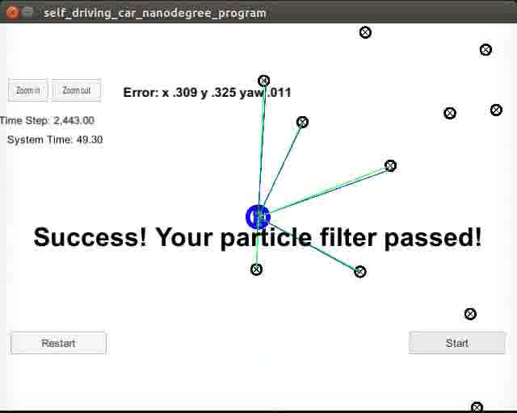

# Particle Filter - Kidnapped Vehicle Localization


## Project 
In this project a 2D particle filter has been implementedf in C++. The particle filter is given a map and some initial localization information (analogous to what a GPS would provide). At each time step the filter will also get noisy observation and control data.

## Filter inputs

// sense noisy position data from the simulator

["sense_x"]

["sense_y"]

["sense_theta"]

// get the previous velocity and yaw rate to predict the particle's transitioned state

["previous_velocity"]

["previous_yawrate"]

// receive noisy observation data from the simulator, in a respective list of x/y values

["sense_observations_x"]

["sense_observations_y"]


## Filter outputs

// best particle values used for calculating the error evaluation

["best_particle_x"]

["best_particle_y"]

["best_particle_theta"]

//Optional message data used for debugging particle's sensing and associations

// for respective (x,y) sensed positions ID label

["best_particle_associations"]

// for respective (x,y) sensed positions

["best_particle_sense_x"] <= list of sensed x positions

["best_particle_sense_y"] <= list of sensed y positions


# Particle Filter Implemention

## initialization

1. Generate 137 particles (NUM_PARTICLES=137)
2. Initialize location and angle randomly about the initial location


## prediction

1. Receive control variables
2. Update according to motion equations
3. Numerical stability - special care has been taken for (close to) zero yaw rate

## dataAssociation

1. Recieve observations & landmark map
2. Transform obervations to the global map, according to particle parameters


## Weights updating

1. Recieve observations & landmark map
2. For every particle

    2.1. Transform obervations to the global map, according to particle parameters

    2.2. Generate association between observations
    
    2.3. Estimate the particle weight - generate total probability for matches according to Gaussian distance probability measure
    
    2.4. Add weight to the total weight sum
    
    2.5. Set the associations for the particle (SetAssociations function)

3. Normalize
    
    3.1. If total weight sum is 0, normalize each weight to 1 / NUM_PARTICLES

    3.2. Otherwise - normalize according to the total weight sum

4. Resample

    The purpose of this stage is to randomly choose particles, proportionally to their relative weights.

    4.1. Create a list of weights, normalize by the lowest nonzero weight

    4.2. Using std library's ```discrete_distribution``` to generate relative probability sampling, sample NUM_PARTICLES new particles

    4.3. Update particle list with the newly generated particle list


## Results Success Criteria


1. **Accuracy & Performance**: 

| Measure  | value   | MEETS SPECIFICATIONS |
|---|---|---|
| Error x | 0.309    | Y |
| Error y | 0.325   | Y |
| Error yaw | 0.011 | Y |
| Running time | 49.30 | Y|




